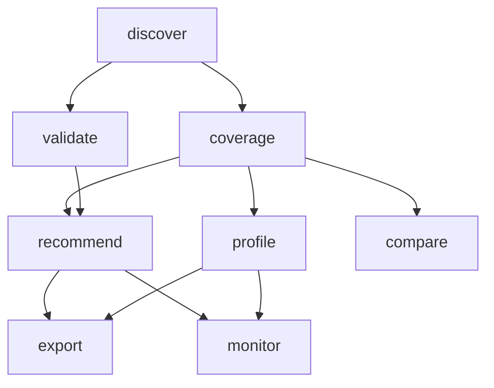

# 🚀 CTU Analysis Verbs - Innovative Verb Architecture Design

## 📋 **Current State Analysis**

### **❌ Current Verb Limitations:**
- **Generic naming**: `analyze`, `stats`, `report`, `export` don't convey AST innovation
- **Overlapping functionality**: Multiple verbs do similar things
- **Missing capabilities**: No discovery, validation, or optimization verbs
- **Poor user experience**: Confusing verb names and purposes

### **✅ Core Capabilities Identified:**
1. **🔍 CLI Structure Discovery**: AST-based command and subcommand discovery
2. **📦 Import Resolution**: Dynamic import tracking and dependency mapping
3. **🧪 Test Pattern Discovery**: AST-based test usage extraction
4. **📊 Coverage Analysis**: Multi-dimensional coverage calculation
5. **💡 Smart Recommendations**: AI-powered improvement suggestions
6. **📈 Performance Profiling**: Analysis performance monitoring
7. **🔄 Format Conversion**: Universal output format support
8. **📋 Report Generation**: Comprehensive analysis reports

## 🎯 **New Innovative Verb Architecture**

### **🚀 Primary Analysis Verbs**

#### **1. `discover` - CLI Structure Discovery**
```bash
ctu analysis discover [options]
```
**Purpose**: Discover and analyze CLI structure using AST parsing
**Capabilities**:
- Parse CLI definition files with AST
- Extract commands, subcommands, flags, and options
- Track imported commands and dependencies
- Generate CLI structure map
- Validate CLI definition integrity

**Options**:
- `--cli-path`: Path to CLI file to analyze
- `--format`: Output format (text, json, yaml)
- `--include-imports`: Include import analysis
- `--validate`: Validate CLI structure
- `--verbose`: Enable detailed output

#### **2. `coverage` - Coverage Analysis**
```bash
ctu analysis coverage [options]
```
**Purpose**: Analyze test coverage using AST-based pattern matching
**Capabilities**:
- Discover test patterns from test files
- Calculate multi-dimensional coverage
- Generate coverage statistics
- Identify untested components
- Provide coverage insights

**Options**:
- `--cli-path`: Path to CLI file
- `--test-dir`: Test directory to analyze
- `--format`: Output format (text, json, html)
- `--threshold`: Coverage threshold percentage
- `--trends`: Include trend analysis
- `--verbose`: Enable detailed output

#### **3. `recommend` - Smart Recommendations**
```bash
ctu analysis recommend [options]
```
**Purpose**: Generate intelligent recommendations for improving coverage
**Capabilities**:
- Analyze coverage gaps
- Prioritize untested components
- Suggest specific test improvements
- Provide actionable guidance
- Generate improvement plans

**Options**:
- `--cli-path`: Path to CLI file
- `--test-dir`: Test directory to analyze
- `--priority`: Recommendation priority (high, medium, low)
- `--format`: Output format (text, json, markdown)
- `--actionable`: Focus on actionable recommendations
- `--verbose`: Enable detailed output

#### **4. `profile` - Performance Profiling**
```bash
ctu analysis profile [options]
```
**Purpose**: Profile analysis performance and optimize execution
**Capabilities**:
- Monitor analysis performance
- Identify performance bottlenecks
- Optimize analysis execution
- Generate performance reports
- Provide optimization suggestions

**Options**:
- `--cli-path`: Path to CLI file
- `--test-dir`: Test directory to analyze
- `--benchmark`: Run performance benchmarks
- `--optimize`: Apply performance optimizations
- `--format`: Output format (text, json, csv)
- `--verbose`: Enable detailed output

#### **5. `validate` - CLI Validation**
```bash
ctu analysis validate [options]
```
**Purpose**: Validate CLI structure and test coverage integrity
**Capabilities**:
- Validate CLI definition structure
- Check import resolution integrity
- Verify test pattern consistency
- Identify structural issues
- Generate validation reports

**Options**:
- `--cli-path`: Path to CLI file
- `--test-dir`: Test directory to analyze
- `--strict`: Enable strict validation
- `--fix`: Attempt to fix issues
- `--format`: Output format (text, json)
- `--verbose`: Enable detailed output

### **🔄 Utility Verbs**

#### **6. `export` - Data Export**
```bash
ctu analysis export [options]
```
**Purpose**: Export analysis data in various formats
**Capabilities**:
- Export coverage data to JSON, CSV, XML
- Generate Turtle/RDF for semantic web
- Create markdown documentation
- Export performance metrics
- Generate API-compatible data

**Options**:
- `--format`: Export format (json, csv, xml, turtle, markdown)
- `--output`: Output file path
- `--template`: Custom template for export
- `--include-metadata`: Include analysis metadata
- `--verbose`: Enable detailed output

#### **7. `compare` - Analysis Comparison**
```bash
ctu analysis compare [options]
```
**Purpose**: Compare different analysis results or CLI versions
**Capabilities**:
- Compare coverage between versions
- Analyze coverage trends over time
- Compare CLI structure changes
- Generate diff reports
- Identify regression issues

**Options**:
- `--baseline`: Baseline analysis file
- `--current`: Current analysis file
- `--format`: Output format (text, json, html)
- `--trends`: Include trend analysis
- `--verbose`: Enable detailed output

#### **8. `monitor` - Continuous Monitoring**
```bash
ctu analysis monitor [options]
```
**Purpose**: Monitor coverage and performance continuously
**Capabilities**:
- Continuous coverage monitoring
- Performance trend tracking
- Automated reporting
- Alert generation
- Integration with CI/CD

**Options**:
- `--watch`: Watch mode for continuous monitoring
- `--interval`: Monitoring interval in seconds
- `--alerts`: Enable alert generation
- `--webhook`: Webhook URL for notifications
- `--verbose`: Enable detailed output

## 🏗️ **Verb Architecture Design**

### **🎯 Verb Categories**

#### **Primary Analysis Verbs**
- `discover`: CLI structure discovery
- `coverage`: Coverage analysis
- `recommend`: Smart recommendations
- `profile`: Performance profiling
- `validate`: CLI validation

#### **Utility Verbs**
- `export`: Data export
- `compare`: Analysis comparison
- `monitor`: Continuous monitoring

#### **Legacy Support Verbs**
- `analyze`: Legacy analysis (deprecated)
- `stats`: Legacy statistics (deprecated)
- `report`: Legacy reporting (deprecated)

### **🔄 Verb Relationships**



### **📊 Verb Capabilities Matrix**

| Verb | CLI Discovery | Test Analysis | Coverage Calc | Recommendations | Performance | Validation | Export |
|------|---------------|---------------|---------------|-----------------|-------------|------------|--------|
| `discover` | ✅ | ❌ | ❌ | ❌ | ❌ | ✅ | ✅ |
| `coverage` | ✅ | ✅ | ✅ | ❌ | ❌ | ❌ | ✅ |
| `recommend` | ✅ | ✅ | ✅ | ✅ | ❌ | ❌ | ✅ |
| `profile` | ✅ | ✅ | ✅ | ❌ | ✅ | ❌ | ✅ |
| `validate` | ✅ | ✅ | ✅ | ❌ | ❌ | ✅ | ✅ |
| `export` | ✅ | ✅ | ✅ | ✅ | ✅ | ✅ | ✅ |
| `compare` | ✅ | ✅ | ✅ | ✅ | ✅ | ✅ | ✅ |
| `monitor` | ✅ | ✅ | ✅ | ✅ | ✅ | ✅ | ✅ |

## 🚀 **Implementation Strategy**

### **Phase 1: Core Verbs**
1. **`discover`**: CLI structure discovery
2. **`coverage`**: Coverage analysis
3. **`recommend`**: Smart recommendations

### **Phase 2: Advanced Verbs**
4. **`profile`**: Performance profiling
5. **`validate`**: CLI validation

### **Phase 3: Utility Verbs**
6. **`export`**: Data export
7. **`compare`**: Analysis comparison
8. **`monitor`**: Continuous monitoring

### **Phase 4: Legacy Migration**
9. **Deprecate old verbs**: `analyze`, `stats`, `report`
10. **Migration guide**: Help users transition to new verbs

## 🎯 **Benefits of New Verb Architecture**

### **1. Clear Purpose**
- Each verb has a specific, well-defined purpose
- No overlapping functionality
- Intuitive naming that conveys capability

### **2. Better User Experience**
- Logical verb progression
- Clear command structure
- Consistent parameter patterns

### **3. Enhanced Capabilities**
- AST-first design throughout
- Performance optimization
- Smart recommendations
- Continuous monitoring

### **4. Future-Proof Design**
- Extensible architecture
- Plugin support
- Cloud integration ready
- CI/CD pipeline compatible

## 📋 **Next Steps**

1. **Design detailed verb specifications**
2. **Create verb implementation architecture**
3. **Implement core verbs (discover, coverage, recommend)**
4. **Test and validate new verb capabilities**
5. **Create migration guide for existing users**
6. **Update documentation and examples**

This new verb architecture provides a **clear, intuitive, and powerful** interface for the innovative AST-based CLI coverage analysis system! 🚀
